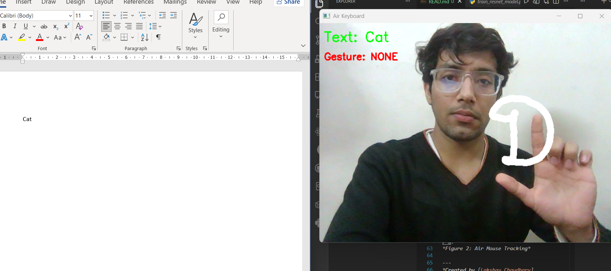
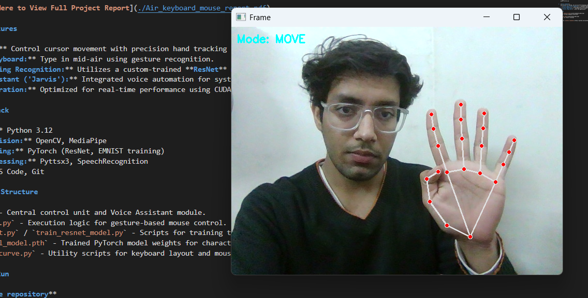

# Air Keyboard & Mouse (AI-Powered Interface)

A touchless virtual mouse and keyboard system powered by Computer Vision and Deep Learning. This project enables users to control their computer using hand gestures and voice commands, eliminating the need for physical peripherals.

## 📄 [Click Here to View Full Project Report](./Air_keyboard_mouse_report.pdf)

## 🚀 Key Features

* **Air Mouse:** Control cursor movement with precision hand tracking and fingertip detection.
* **Virtual Keyboard:** Type in mid-air using gesture recognition.
* **Deep Learning Recognition:** Utilizes a custom-trained **ResNet** model on the **EMNIST** dataset for high-accuracy character recognition.
* **Voice Assistant ('Jarvis'):** Integrated voice automation for system commands and hands-free control.
* **GPU Acceleration:** Optimized for real-time performance using CUDA (if available).

## 🛠️ Tech Stack

* **Language:** Python 3.12
* **Computer Vision:** OpenCV, MediaPipe
* **Deep Learning:** PyTorch (ResNet, EMNIST training)
* **Voice Processing:** Pyttsx3, SpeechRecognition
* **Tools:** VS Code, Git

## 📂 Project Structure

* `jarvis.py` - Central control unit and Voice Assistant module.
* `air_mouse_2.py` - Execution logic for gesture-based mouse control.
* `train_emnist.py` / `train_resnet_model.py` - Scripts for training the deep learning models.
* `emnist_final_model.pth` - Trained PyTorch model weights for character recognition.
* `key.py` & `curve.py` - Utility scripts for keyboard layout and mouse smoothing algorithms.

## ⚡ How to Run

1.  **Clone the repository**
    ```bash
    git clone [https://github.com/Lakshay076/Air-Keyboard-Mouse.git](https://github.com/Lakshay076/Air-Keyboard-Mouse.git)
    cd Air-Keyboard-Mouse
    ```

2.  **Install Dependencies**
    ```bash
    pip install -r requirements.txt
    ```

3.  **Run the Application**
    Start the main assistant:
    ```bash
    python jarvis.py
    ```

4.  **Voice Commands**
    Once Jarvis is running, you can use the following commands:
    * **"Jarvis open virtual keyboard"** - Launches the gesture typing interface.
    * **"Close keyboard"** - Shuts down the virtual keyboard.
    * **"Jarvis open mouse"** - Activates the air mouse control.
    * **"Jarvis sleep now"** - Exits the application.

## 📸 Demo


*Figure 1: Virtual Keyboard Interface*


*Figure 2: Air Mouse Tracking*

---
*Created by [Lakshay Chaudhary](https://github.com/Lakshay076)*